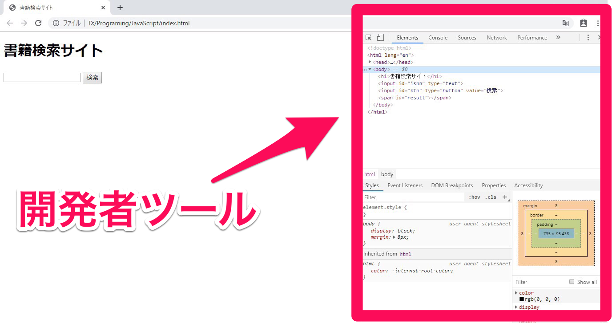
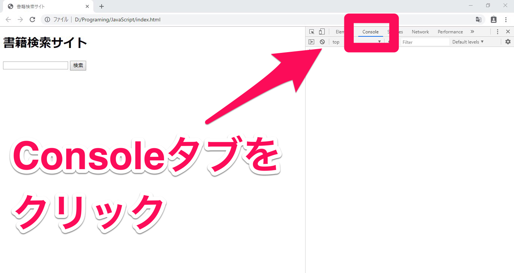
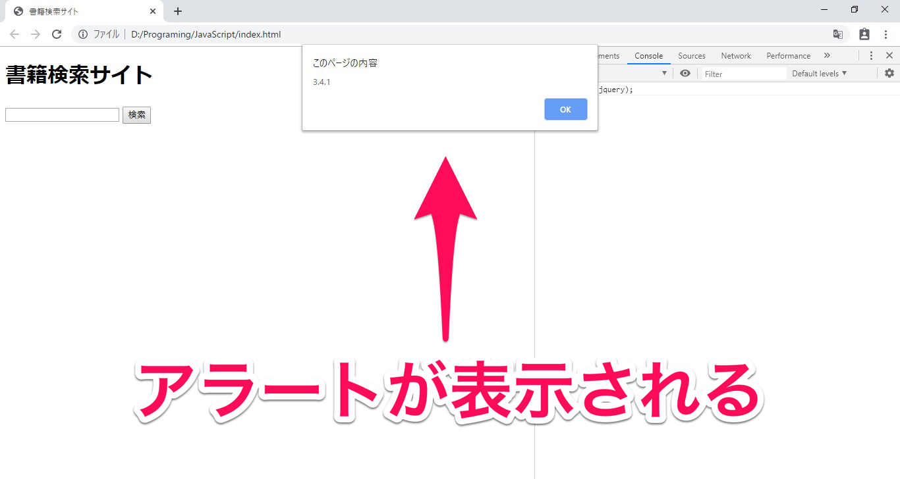
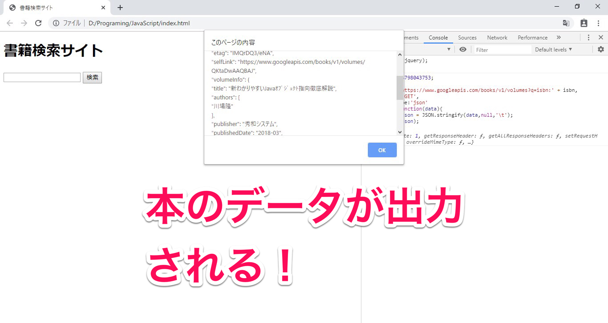
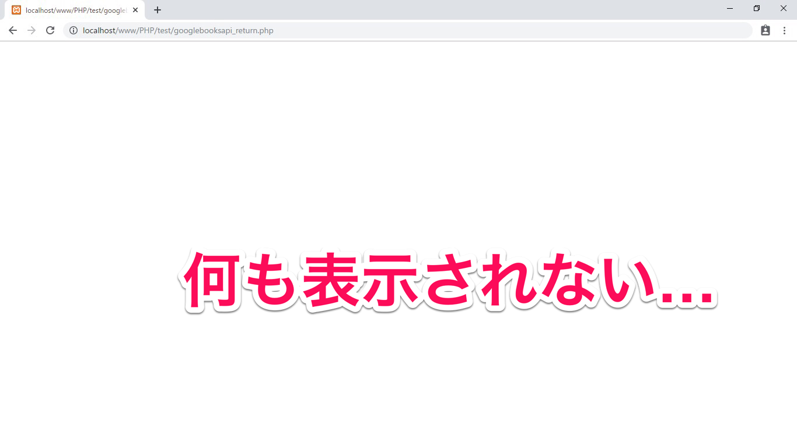
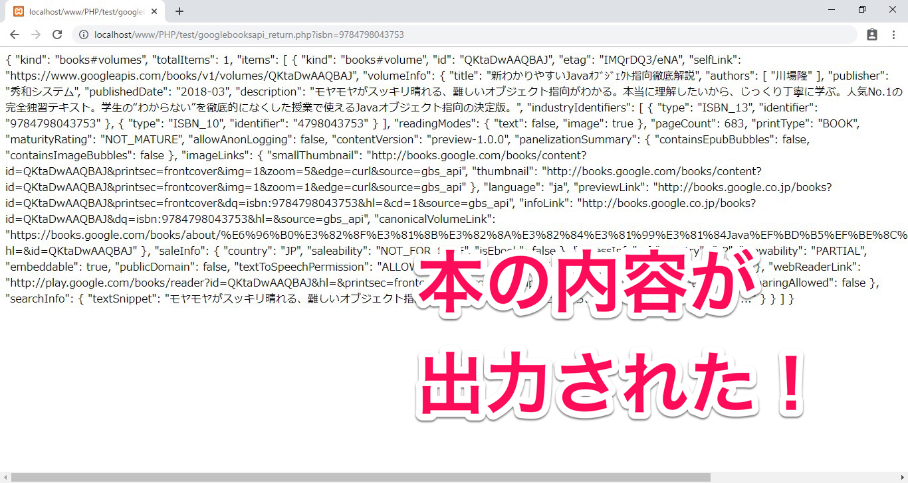
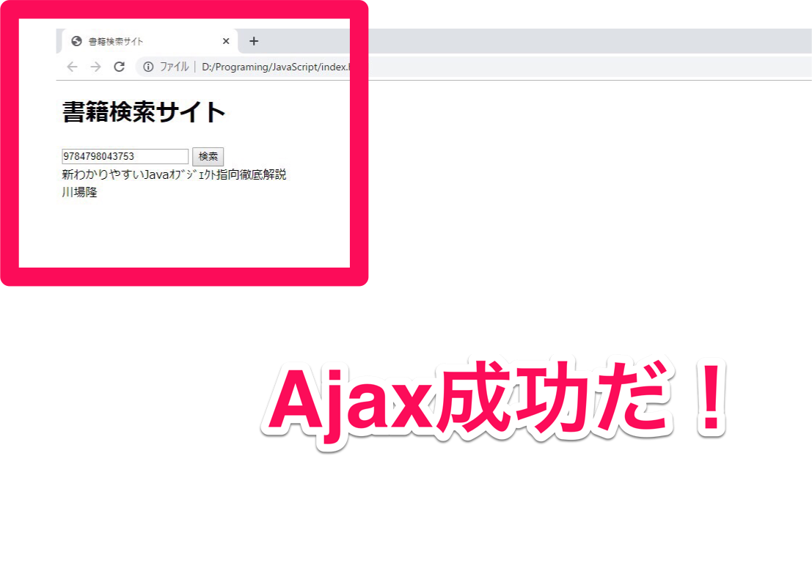

## はじめに

この準備授業では下記環境を使用します。
これ以外の環境についてはサポートいたしかねますから、予めご承知ください。

- Windows 10
- Visual Studio Code
- XAMPP
- Chrome

## 今日確認する内容

- jQueryを利用してみよう
- Ajaxって何？
- 取得したデータを出力しよう

## 1.jQueryを利用してみよう

今回の開発ではAjaxという技術を使ってデータを取得します。
前回、PHPを使って、サイトにアクセスするたびにデータが更新されるページを作成していきました。しかし、Ajaxを利用すると、ページを更新させずにデータを取得して、画面を書き換えることができるようになります。

Ajaxを利用するには、JavaScriptでコードを書く必要があります。しかし、JavaScriptをそのまま書いていると結構な手間がかかります。そのため、今回はAjaxを簡単に行うことできる「jQuery」というライブラリを利用して作成していきたいと思います。

まずはjQueryをサイトに組み込んでいきます。
組み込むと言っても特段難しいことは無いので、サクッと導入してしまいましょう。

まずは、index.htmlを作成します。

```
<!DOCTYPE html>
<html lang="ja">
<head>
    <meta charset="UTF-8">
    <meta name="viewport" content="width=device-width, initial-scale=1.0">
    <meta http-equiv="X-UA-Compatible" content="ie=edge">
    <title>書籍検索サイト</title>
</head>
<body>
    <h1>書籍検索サイト</h1>
    <input id="isbn" type="text">
    <input id="btn" type="button" value="検索"><br />
    <span id="result"></span>
</body>
</html>
```

できたら、titleタグの下に以下のコードを追加してください。これはコピペで大丈夫です。

```
<script
  src="https://code.jquery.com/jquery-3.4.1.min.js"
  integrity="sha256-CSXorXvZcTkaix6Yvo6HppcZGetbYMGWSFlBw8HfCJo="
  crossorigin="anonymous"></script>
```

インターネットに接続してないと動作しないので注意してください。

これだけでjQueryの導入が完了しました！簡単ですね。早速使ってみましょう。

作成したサイトをChromeで開いて、F12で開発者ツールを開いてください。



開発者ツールのConsoleタブをクリックしましょう。



何やら白い画面が出てきましたね。
ChromeではここでJavaScriptをコマンドライン入力で実行することができます。次のコードを実行してみましょう。

```
alert($.fn.jquery);
```



アラートが表示されましたか？今表示された数字がjQueryのバージョンになります。

ではいきなりですが、今回もGoogle Books APIsからデータを取得してみましょう。
ただし、ページは更新せずに取得していきます。

次のコードをVisualStudioCodeで書いて、Consoleに貼り付けましょう。ISBNは変更していただいても構いません。

```
isbn = 9784798043753;
$.ajax({
	url: 'https://www.googleapis.com/books/v1/volumes?q=isbn:' + isbn,
	type: 'GET',
	dataType:'json'
}).done( function(data){
	const json = JSON.stringify(data,null,'\t');
	alert(json);
});
```

では実行してみます。



アラートに本のデータが出力されましたね！ページを更新させずに外部からデータを取得することができました。

少しコードを見てみましょう。一行目に```$.ajax```と書かれていますが、これは何でしょうか。

```
$.ajax({  //なんだこれ？
```

$マークが書かれていますが、なにやら後ろにくっついていますね。この$って何でしょう？
変数と思った方は惜しい。しかしJavaScriptでは変数の前に$マークはつきません。

実はこの$マークは、**jQueryの機能が一つに詰め込まれたオブジェクト**なんです。

jQueryの機能を扱うには全てこの$オブジェクトからアクセスします。
ちなみに```jQuery```でもアクセスできます。
```
alert( $ === jQuery ); //true
```

今回のコードではjQueryのAjax機能を利用するために```$```の中にある```ajax```という関数を利用しています。

ajax関数では引数に連想配列で取得の方法を指定できます。

```
$.ajax({
	url: 'https://www.googleapis.com/books/v1/volumes?q=isbn:' + isbn,
	type: 'GET',
	dataType:'json'
})
```

- ```url```はデータを取得したいURLを指定します。
- ```type```にはGETかPOSTを指定して、HTTP通信の種類を設定します。
- ```dataType```にはサーバから返されるデータの種類を指定できます。

これらを設定し実行するだけで、ajax関数がデータを取得してきてくれます。

```url```にはGoogle Books APIsのURLに```isbn```変数に格納された値をくっつけて書き込んでいます。

データの取得に成功した場合、```.done```関数に記述した処理が実行されます。

```
}).done( function(data){
    //ここに書いた処理が実行される
})
```

詳しいことは書きませんが、JavaScriptでは関数も値なので、引数に関数を書くことができます。```function(){}```の部分がそうですね。```.done```の引数に関数を指定しておくと、データを取得した時に**後でその関数を勝手に実行してくれます。**このような関数を**コールバック関数**といいます。説明すると長くなるので興味があれば各自調べてみてください。

ajax関数で取得したデータはコールバック関数内の```data```に格納されています。
jQueryでは、JSONデータを取得すると自動的にJSONデータを連想配列に変換してくれます。（今回のコードでは見やすくするために ```JSON.stringfy()``` で文字列に変換しています。）


連想配列のデータにアクセスする場合はPHPとほとんど同じです。PHPで連想配列のデータにアクセスする際は、

```
$data['items'][0]['volumeInfo']['title'];
```

このように書けましたが、JavaScriptでは下記のようになります。

```
data['items'][0]['volumeInfo']['title'];
```

変数の前に$マークが無いこと以外一緒ですね。

後はこのデータをHTMLに反映させれば動的にページを書き換えることが可能になります。

## Ajaxって何？

さっきから何度もAjaxと言ったり書いたりしていますが、Ajaxとは```Asynchronous JavaScript + XML```の略語です。

**Asynchronous**とは、**非同時性の、非同期の**といった意味です。

要するに「JavaScriptとかXMLを使って、ページを更新せずにサーバと通信しようよ」ってことです。

Ajaxが活用されている良い例はGoogle Mapでしょうか。

Google Mapは拡大したり縮小したりしても、いちいちページを更新したりはしないですよね。

私達がマップを操作すると、裏でJavaScriptが動作して、サーバからデータを取得し、差分のあった部分のみのHTMLを更新してくれます。サーバ側からの応答を待つ必要が無いので、画面を更新したり、画面が白くなったりせずにクライアント側は操作を継続できます。

いちいち更新をこちらが待たなくていいのはかなり便利ですよね。

ちなみにXMLと書かれていますが、最近はJSONでサーバとやり取りするのが主流となっています。

## 取得したデータを出力しよう

先程のコードでは更新せずに、つまり非同期的にデータを取得していきました。
あとは、取得したデータをHTMLに反映させれば、ページを更新せずに内容を書き換えることができます。しかし、JavaScriptにはPHPのprintやechoの様な、HTMLをそのまま出力する術がありません。どうすればよいのでしょう？

実はHTMLを書くと、内部で**DOM**（Document Object Model）というオブジェクトが作成されます。このDOMはHTMLとリンクしていて、DOMを書き換えると、自動的にHTMLも書き変わるという仕組みです。このDOMからHTML内のデータにアクセスすることも自由自在です。そしてなんと、このDOMもjQueryを使って書き換えることができます。

少しピンときづらいかもしれないので、とりあえずこのコードをVisualStudioCodeで書いてみましょう。このコードは後で使うので残しておいてください。

```
isbn = $('#isbn').val();
$.ajax({
	url: 'https://www.googleapis.com/books/v1/volumes?q=isbn:' + isbn,
	type: 'GET',
	dataType:'json'
}).done( function(data){
	const title = data['items'][0]['volumeInfo']['title'];
	const authors = data['items'][0]['volumeInfo']['authors'][0];

	$('#result').html(title + '<br />' + authors);
});
```

書けたらConsoleで実行するのですが、その前に**検索欄にISBNコードを入力してから、**実行してみてください。



inputタグからでISBNコードを取得して、HTMLが更新されました！

コードを見てみると、```$```がまたもや登場しています。今度は```$```の後ろに```()```がついてますね。

これはjQueryでDOMにアクセスするときに書きます。書き方は下記の通りです。

```
$("セレクタ");
```

セレクタとは、CSSでHTMLを装飾するとき、HTMLのどの要素を装飾するか指定しますよね。あれがセレクタです。

jQueryではセレクタで要素を指定して内容を書き換えたり取得したりできます。

先程書いたコードではinputタグの値は```.val()```メソッドで取得しています。

```
isbn = $('#isbn').val();
```

idがisbnと指定されている要素をセレクタでDOMから取得して、```.val()```メソッドでinputタグの値を取り出して、```isbn```という変数に格納しています。

inputタグの値をURLにくっつけて送信し、取得した本のデータを```.html```メソッドを使ってspanタグの中に書き込んでいます。

```
$('#result').html(title + '<br />' + authors);
```

PHPのWebページを更新の仕方とはかなり異なるので、少しだけ煩わしいかもしれません…。

後は、このコードが検索ボタンをクリックした時に動作すれば、Consoleを使わずにデータを取得出来る様になりますね。どんどんやっていきましょう。

最初に作成したindex.htmlを開いて、bodyタグの一番下に次のコードを書き足してください。

```
<script type="text/javascript">
	$('#btn').on('click', function(){
		alert('クリックされました！');
	});
</script>
```

index.htmlを保存して、ページを更新したら、検索ボタンを押してみましょう。



ボタンをクリックするとアラートが表示されました。
このコードではセレクタでボタンを指定して、```on```メソッドで```'click'```イベント処理を実装しています。```on```メソッドは、セレクタで取得した要素に、第一引数に指定したイベントが発生すると、第二引数のコールバック関数が実行されます。基本的な構文は下記のとおりです。

```
$('セレクタ').on('イベント', コールバック関数);
```

とにかく、クリックしたらアラートが表示されたということは、このアラートの部分を先程書いた、動的にHTMLを更新するコードに書き換えれば、クリックしたときにHTMLを更新することができるはずです。

さっき残しておいたコードは消していませんよね？
では、さっきのコードをコピーして、```alert('クリックされました！');```の部分を書き換えてしまいましょう！

```
<script type="text/javascript">
	$('#btn').on('click', function(){
		// alert('クリックされました！'); これは削除する
		// ↓ここに貼り付ける
		isbn = $('#isbn').val();
		$.ajax({
			url: 'https://www.googleapis.com/books/v1/volumes?q=isbn:' + isbn,
			type: 'GET',
			dataType:'json'
		}).done( function(data){
			const title = data['items'][0]['volumeInfo']['title'];
			const authors = data['items'][0]['volumeInfo']['authors'][0];

			$('#result').html(title + '<br />' + authors);
		});
	});
</script>
```

ちょっとコードがぐちゃっとするかもしれないので各自コードを整形してください。
では保存してページを更新したら、ISBNコードを入力して、検索をクリックしてみてください。



ボタンをクリックしたら、HTMLが書き換わりましたか？ちゃんと更新せずに、本のタイトルと著者が表示されているのを確認してください。これでページを更新せずにAjaxでデータを検索して、HTMLを書き換えることが出来ました！

少し複雑になってきました。

どういう流れで処理が起こっているか少しまとめてみましょう。

- ページが読み込まれる
- クライアントがinputに文字を入力する
- 検索ボタンを押されたら、イベントが発生してコールバック関数が実行される
- inputタグの値をDOMからjQueryで取得する
- 取得した値をURLにつっつけて、jQueryでGoogle Books APIsに送信する
- 返ってきたJSONデータは自動で連想配列に変換される
- 取得したいデータを取り出して、DOMにjQueryで書き込む
- HTMLが更新される

このような手順を踏んでサイトを書き換えています。

一見複雑に見えますが、結局の所JavaScriptで入力を取得し、サーバ側でJSONに変換されたデータJavaScriptで取得して、そのデータを元にHTMLをJavaScriptで書き換えているだけなのです。