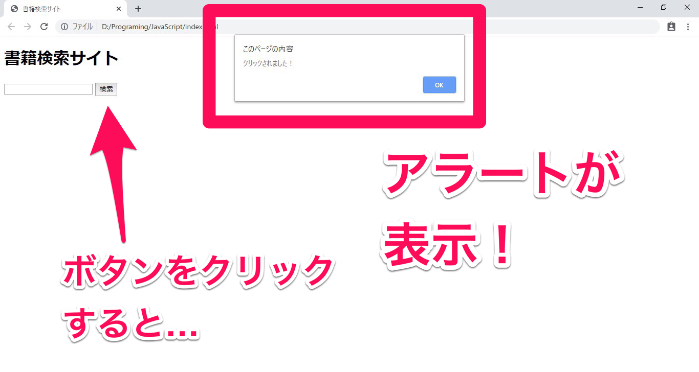
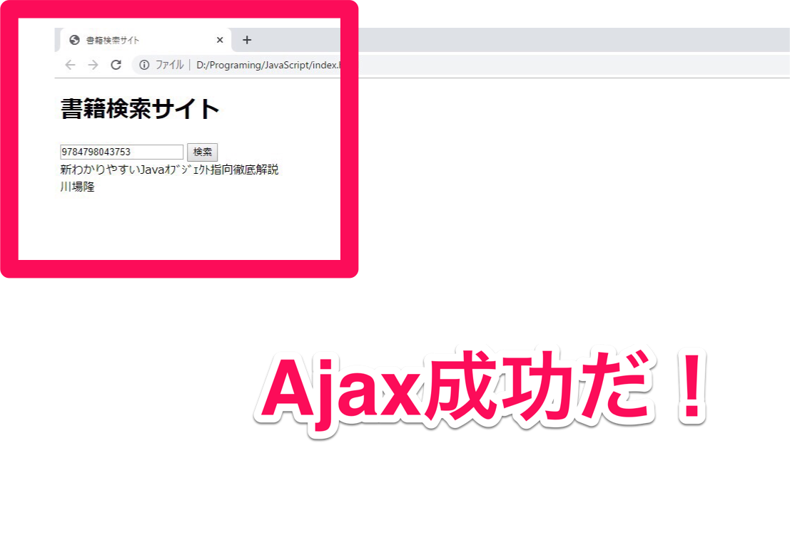

## はじめに

この準備授業では下記環境を使用します。
これ以外の環境についてはサポートいたしかねますから、予めご承知ください。

- Windows 10
- Visual Studio Code
- XAMPP
- Chrome

## 今日確認する内容

- jQueryを利用してみよう
- Ajaxって何？
- 取得したデータを出力しよう
- ローディング画面を表示しよう

## 1.jQueryを利用してみよう

今回の開発では**Ajax**という技術を使ってデータを取得します。
前回、PHPを使って、サイトにアクセスするたびにデータが更新されるページを作成していきました。しかし、Ajaxを利用すると、**ページを更新させずに**データを取得して、画面を書き換えることができるようになります。

Ajaxを利用するには、**JavaScript**でコードを書く必要があります。しかし、JavaScriptをそのまま書いていると結構な手間がかかります。そのため、今回はAjaxを簡単に行うことできる**jQuery**というライブラリを利用して作成していきたいと思います。

まずはjQueryをサイトに組み込んでいきます。
組み込むと言っても特段難しいことは無いので、サクッと導入してしまいましょう。

まずは、index.htmlを作成します。

```html
<!DOCTYPE html>
<html lang="ja">
<head>
  <meta charset="UTF-8">
  <meta name="viewport" content="width=device-width, initial-scale=1.0">
  <meta http-equiv="X-UA-Compatible" content="ie=edge">
  <title>書籍検索サイト</title>
</head>
<body>
  <h1>書籍検索サイト</h1>
  <input id="isbn" type="text">
  <input id="btn" type="button" value="検索"><br />
  <span id="result"></span>
</body>
</html>
```

できたら、titleタグの下に以下のコードを追加してください。これはコピペで大丈夫です。

```html
<script
  src="https://code.jquery.com/jquery-3.4.1.min.js"
  integrity="sha256-CSXorXvZcTkaix6Yvo6HppcZGetbYMGWSFlBw8HfCJo="
  crossorigin="anonymous"></script>
```

インターネットに接続してないと動作しないので注意してください。

これだけでjQueryの導入が完了しました！簡単ですね。早速使ってみましょう。

作成したサイトをChromeで開いて、F12で開発者ツールを開いてください。


開発者ツールのConsoleタブをクリックしましょう。


何やら白い画面が出てきましたね。
ChromeではここでJavaScriptをコマンドライン入力で実行することができます。次のコードを実行してみましょう。

```js
alert($.fn.jquery);
```


アラートが表示されましたか？今表示された数字がjQueryのバージョンになります。

ではいきなりですが、今回もGoogle Books APIsからデータを取得してみましょう。
ただし、ページは更新せずに取得していきます。

次のコードをVisualStudioCodeで書いて、Consoleに貼り付けましょう。ISBNは変更していただいても構いません。

```js
isbn = 9784798043753;
$.ajax({
  url: 'https://www.googleapis.com/books/v1/volumes?q=isbn:' + isbn,
  type: 'GET',
  dataType:'json'
}).done( function(data){
  const json = JSON.stringify(data,null,'\t');
  alert(json);
});
```

では実行してみます。


アラートに本のデータが出力されましたね！ページを更新させずに外部からデータを取得することができました。

少しコードを見てみましょう。一行目に```$.ajax```と書かれていますが、これは何でしょうか。

```
$.ajax({  //なんだこれ？
```

$マークが書かれていますが、なにやら後ろにくっついていますね。この$って何でしょう？
変数と思った方は惜しい。しかしJavaScriptでは変数の前に$マークはつきません。

実はこの$マークは、**jQueryの機能が一つに詰め込まれたオブジェクト**なんです。

jQueryの機能を扱うには全てこの$オブジェクトからアクセスします。
ちなみに```jQuery```でもアクセスできます。

```js
alert( $ === jQuery ); //true
```

今回のコードではjQueryのAjax機能を利用するために```$```の中にある```ajax```という関数を利用しています。

ajax関数では引数に連想配列で取得の方法を指定できます。

```js
$.ajax({
  url: 'https://www.googleapis.com/books/v1/volumes?q=isbn:' + isbn,
  type: 'GET',
  dataType:'json'
})
```

- ```url```はデータを取得したいURLを指定します。
- ```type```にはGETかPOSTを指定して、HTTP通信の種類を設定します。
- ```dataType```にはサーバから返されるデータの種類を指定できます。

これらを設定し実行するだけで、ajax関数がデータを取得してきてくれます。

```url```にはGoogle Books APIsのURLに```isbn```変数に格納された値をくっつけて書き込んでいます。

データの取得に成功した場合、```.done```関数に記述した処理が実行されます。

```js
}).done( function(data){
  //ここに書いた処理が実行される
})
```

詳しいことは書きませんが、JavaScriptでは関数も値なので、引数に関数を書くことができます。```function(){}```の部分がそうですね。```.done```の引数に関数を指定しておくと、データを取得した時に**後でその関数を勝手に実行してくれます**。このような関数を**コールバック関数**といいます。説明すると長くなるので興味があれば各自検索して調べてみてください。

ajax関数で取得したデータはコールバック関数内の```data```に格納されています。
jQueryでは、JSONデータを取得すると自動的にJSONデータを連想配列に変換してくれます。（今回のコードでは見やすくするために ```JSON.stringfy()``` で文字列に変換しています。）


連想配列のデータにアクセスする場合はPHPとほとんど同じです。PHPで連想配列のデータにアクセスする際は、

```
$data['items'][0]['volumeInfo']['title'];
```

このように書けましたが、JavaScriptでは下記のようになります。

```
data['items'][0]['volumeInfo']['title'];
```

変数の前に$マークが無いこと以外一緒ですね。

後はこのデータをHTMLに反映させれば動的にページを書き換えることが可能になります。

ただし、このコードには一つ問題があります。それは、JavaScriptはサイトを開いた後もConsoleで実行出来てしまうため、ユーザが他のサーバの悪質なAPIを叩いて、サイトが改ざんされてしまう可能性があるということです。

そのため、ブラウザはCORS(Cross-Origin Resource Sharing)という規則にしたがって、基本的にJavaScriptではクロスドメイン通信は出来ないようになっています。前回の教科書のコラムにも書いてあります。Google Books APIはサーバ側でクロスドメイン通信を許可する設定になっているので直接アクセス出来てしまいますが、それはGoogleが世界からある程度の信頼を得ているから出来る事で、今はGoogle以外のAPIもたくさんあります。そもそもGoogle APIにだって脆弱性が潜んでいてもおかしくはありません。

ではどうするのか？

実は結構簡単です。直接外部のデータをJavaScriptで受け取るのが危険ならば、PHPで受け取ってしまえばいいのです。JavaScriptには**自分のサーバにだけにアクセス**させて、PHPがAPIを叩いて受け取ったデータをそのままJavaScriptに横流ししてしまえば、JavaScriptでのクロスドメイン通信を防ぐことができます。

外部とのやり取りはPHPに任せて、JavaScriptは内部との通信のみに役割を分担するわけです。

早速やってみましょう。
index.htmlと同じフォルダにgooglebooksapi_return.phpというファイルを作成してください。
やることは至ってシンプルですのでちゃちゃっと書いてしまいましょう。

```php
<?php
  if(isset($_GET['isbn'])){
    $url = "https://www.googleapis.com/books/v1/volumes?q=isbn:" . $_GET['isbn'];
    $data = file_get_contents($url);
    print $data;
  }
```

やっていることは前回やったことを思い出せば簡単です。

データを取得したいURLを```$url```に格納して、```file_get_contents($url)```で取得したデータをprintで出力しています。それだけです。

localhostでこのPHPにアクセスしてみましょう。


真っ白ですね。（エラーが発生する人は教えて下さい）

ではURLの```/googlebooksapi_return.php```に```?isbn=9784798043753```を追加して、アクセスしてみてください。


ちゃんと表示されていますね。これでPHPからAPIを叩くことが出来ました。そしてこのPHP自体もAPI化しているので、後はこのデータをJavaScriptで取得すればいいのです。

先程VisualStudioCodeで書いたJavaScriptのコードを開いてください。```url```のところにはGoogle Books APIのURLが直接指定してありますね。これを先程書いたPHPにアクセスするように書き換えてください。

あえてコードは書きません。自分で考えて変更してみましょう。**ヒントは相対パスです**。

## Ajaxって何？

さっきから何度もAjaxと言ったり書いたりしていますが、Ajaxとは```Asynchronous JavaScript + XML```の略語です。

**Asynchronous**とは、**非同時性の、非同期の**といった意味です。

要するに「JavaScriptとかXMLを使って、ページを更新せずにサーバと通信しようよ」ってことです。

Ajaxが活用されている良い例はGoogle Mapでしょうか。

Google Mapは拡大したり縮小したりしても、いちいちページを更新したりはしないですよね。

私達がマップを操作すると、裏でJavaScriptが動作して、サーバからデータを取得し、差分のあった部分のみのHTMLを更新してくれます。サーバ側からの応答を待つ必要が無いので、画面を更新したり、画面が白くなったりせずにクライアント側は操作を継続できます。

いちいち更新をこちらが待たなくていいのはかなり便利ですよね。

XMLと書かれていますが、最近はJSONでサーバとやり取りするのが主流となっています。

## 取得したデータを出力しよう

先程のコードでは更新せずに、つまり非同期的にデータを取得していきました。
あとは、取得したデータをHTMLに反映させれば、ページを更新せずに内容を書き換えることができます。しかし、JavaScriptにはPHPのprintやechoの様な、HTMLをそのまま出力する術がありません。どうすればよいのでしょう？

実はHTMLを書くと、内部で**DOM**（Document Object Model）というオブジェクトが作成されます。このDOMはHTMLとリンクしていて、DOMを書き換えると、自動的にHTMLも書き変わるという仕組みです。このDOMからHTML内のデータにアクセスすることも自由自在です。そしてなんと、このDOMもjQueryを使って書き換えることができます。

少しピンときづらいかもしれないので、とりあえずこのコードをVisualStudioCodeで書いてみましょう。このコードは後で使うので残しておいてください。

```js
isbn = $('#isbn').val();
$.ajax({
  url: './googlebooksapi_return.php?isbn=' + isbn,
  type: 'GET',
  dataType:'json'
}).done( function(data){
  const title = data['items'][0]['volumeInfo']['title'];
  const authors = data['items'][0]['volumeInfo']['authors'][0];

  $('#result').html(title + '<br />' + authors);
});
```

書けたらConsoleで実行するのですが、その前に**検索欄にISBNコードを入力してから**、実行してみてください。


inputタグからでISBNコードを取得して、HTMLが更新されました！

コードを見てみると、```$```がまたもや登場しています。今度は```$```の後ろに```()```がついてますね。

これはjQueryでDOMにアクセスするときに書きます。書き方は下記の通りです。

```js
$("セレクタ");
```

セレクタとは、CSSでHTMLを装飾するとき、HTMLのどの要素を装飾するか指定しますよね。あれがセレクタです。

jQueryではセレクタで要素を指定して内容を書き換えたり取得したりできます。

先程書いたコードではinputタグの値を```.val()```メソッドで取得しています。

```js
isbn = $('#isbn').val();
```

idがisbnと指定されている要素をセレクタでDOMから取得して、```.val()```メソッドでinputタグの値を取り出して、```isbn```という変数に格納しています。

inputタグの値をURLにくっつけて送信し、取得した本のデータを```.html()```メソッドを使ってspanタグの中に書き込んでいます。

```js
$('#result').html(title + '<br />' + authors);
```

PHPのWebページを更新の仕方とはかなり異なるので、少しだけ煩わしいかもしれません…。

後は、このコードが検索ボタンをクリックした時に動作すれば、Consoleを使わずにデータを取得出来る様になりますね。どんどんやっていきましょう。

最初に作成したindex.htmlを開いて、bodyタグの一番下に次のコードを書き足してください。

```html
<script type="text/javascript">
  $('#btn').on('click', function(){
    alert('クリックされました！');
  });
</script>
```

index.htmlを保存して、ページを更新したら、検索ボタンを押してみましょう。



ボタンをクリックするとアラートが表示されました。
このコードではセレクタでボタンを指定して、```on```メソッドで```'click'```イベント処理を実装しています。```on```メソッドは、セレクタで取得した要素に、第一引数に指定したイベントが発火すると、第二引数のコールバック関数が実行されます。基本的な構文は下記のとおりです。

```js
$('セレクタ').on('イベント', コールバック関数);
```

とにかく、クリックしたらアラートが表示されたということは、このアラートの部分を先程書いた、動的にHTMLを更新するコードに書き換えれば、クリックしたときにHTMLを変えることができるはずです。

さっき残しておいたコードは消していませんよね？
では、さっきのコードをコピーして、```alert('クリックされました！');```の部分を書き換えてしまいましょう！

```js
<script type="text/javascript">
  $('#btn').on('click', function(){
    // alert('クリックされました！'); これは削除する
    // ↓ここに貼り付ける
    isbn = $('#isbn').val();
    $.ajax({
      url: './googlebooksapi_return.php?isbn=' + isbn,
      type: 'GET',
      dataType:'json'
    }).done( function(data){
      const title = data['items'][0]['volumeInfo']['title'];
      const authors = data['items'][0]['volumeInfo']['authors'][0];
  
      $('#result').html(title + '<br />' + authors);
    });
  });
</script>
```

ちょっとコードが乱雑になるかもしれないので各自コードを整形してください。
では保存してページを更新したら、ISBNコードを入力して、検索をクリックしてみてください。



ボタンをクリックしたら、HTMLが書き換わりましたか？ちゃんと更新せずに、本のタイトルと著者が表示されているのを確認してください。これでページを更新せずにAjaxでデータを検索して、HTMLを書き換えることが出来ました！

少し複雑になってきました。

どういう流れで処理が起こっているか少しまとめてみましょう。

1. クライアントがinputに文字を入力する
1. 検索ボタンをクリックしたら、イベントが発火してコールバック関数が実行される
1. inputタグの値をjQueryでDOMから取得する
1. 取得した値をURLにつっつけて、jQueryで内部のAPIを叩く
1. PHPがGoogle Books APIを叩いて、外部からJSONデータを取得する
1. jQueryでPHPからJSONデータを受け取る
1. 取得したいデータを取り出して、DOMにjQueryで書き込む
1. HTMLが更新される

このような手順を踏んでサイトを書き換えています。

一見複雑に見えますが、結局の所JavaScriptで入力を取得し、JavaScriptでAPIを叩いてJSONデータを取得し、そのデータを元にHTMLをJavaScriptで書き換えているだけなのです。

## ローディング画面を表示しよう

さて、ここまでで一通りの仕組みは出来ました。

しかし、ここまで書いてきてなんですが、正直このままではPHPでページを更新しながらデータを書き換えるのと対して変わりませんね。どうせならもう少しページを更新しないことを活かしたいです。

そこで、APIを叩いて結果が返ってくるまでローディング画面が表示されるようにしてみましょう。

SVGファイルを用意したので、下記からダウンロードして使ってください。
[https://drive.google.com/file/d/158XAXE_mqA9hN90bPckxbDERe8Q9MQcQ/view?usp=sharing](https://drive.google.com/file/d/158XAXE_mqA9hN90bPckxbDERe8Q9MQcQ/view?usp=sharing)

画像は好きなところに配置してください。下記のサンプルでは、同フォルダ内のimgフォルダに入れていると想定しています。

ではHTMLを書き換えます。１から書く必要はありません。差分を見ながら変更してください。説明は省きます。

```html
<div id="loading">
    
</div>

<main>
    <h1>書籍検索サイト</h1>
    <input id="isbn" type="text">
    <input id="btn" type="button" value="検索"><br />
    <span id="result"></span>
</main>
```

出来たら以下のCSSを追加してください。

```css
body {
    margin: 0 auto;
}

#loading {
    height: 100%;
    width: 100%;
    position: fixed;
    top: 0;
    background: rgba(0,0,0,0.8);
    text-align: center;
}

#loading_svg {
    height: 80px;
    width: 80px;
    position: absolute;
    top: 0;
    bottom: 0;
    left: 0;
    right: 0;
    margin: auto;
    animation: r1 1s linear infinite;
}

main {
    margin: 8px;
}

@keyframes r1 {
    0%   { transform: rotate(0deg); }
    100% { transform: rotate(360deg); }
}
```

CSSは軽く説明します。

イメージとしては、検索ボタンが押されたら、画面全体に透過させた黒いスクリーンを表示させて、その中心でリングの画像を回転させるという感じなのですが、画像の回転にJavaScriptは使わずCSSだけで実装しています。CSSは非常に進化してきていて、CSS3からはアニメーションを定義できるようなりました。

```@keyframe```でアニメーションを定義して、画像のidの```#loading_svg```に```animation```で設定しています。

ただし、CSS3に対応していないブラウザを考慮する場合は、jQueryなどで記述するか、GIF動画を使用する方法があります。今回は技術に触れるためにも採用しています。

さて、ここまで書けたらもう少しです。この状態でサイトを開くと以下のようになります。

ずっとローディングが回っている状態ですね。後はこれを表示したり、非表示にしたりするだけでローディングを実現できそうです。表示非表示もjQueryで簡単に実装出来ます。

要素を非表示にするには

```js
$('セレクタ').css('display', 'none');
```

非表示にするには

```js
$('セレクタ').show();
```

これだけで表示を切り替える事ができます。

後はこれらを、自分で考えてコードに追加してみましょう。

## 本日の課題（時間が足りない場合は宿題にします）

本日の課題① 前回の事前授業で作成した、現在NHKで放送している番組を取得するAPIを利用し、番組を取得して表示するサイトを作成してください。
本日の課題② 番組が更新されているかを5分間隔で確認し、更新がある場合は表示を更新するサイトを作成してください。

## コラム

### なぜコールバックなのか？なぜjQueryを使用したのか？

JavaScript（ここからはjsと略します。）を書いていて疑問に思った方もいらっしゃるかと思いますが、なぜPHPでは

```php
$data = file_get_contents($url);
// $dataを使った処理
```

の様に取得したコンテンツをいったん変数に格納するようなことが出来るのに、jsでは

```js
$.ajax({
  url: './'
}).done(function(data){
  // dataを使った処理 
});
```

などとコールバックに返された引数を利用しなければならないのでしょう？

PHPの様に

```js
let data = $.ajax({url: ''});
// dataを使った処理
```

のように書ければ非常に簡潔でわかりやすいのに。しかしそれが出来ないのには理由があるのです。

理由は至極単純で、```$.ajax```関数が**非同期処理**だからです。

プログラムというのは通常上から1行づつ実行されていきますよね。例えば一つの処理が1秒かかる場合、次の処理が実行されるまでには1秒かかります。そういう処理は同期処理と言います。PHPの```file_get_contents()```は同期処理ですので、もしAPIを叩いてもサーバーから返答がない場合、次の処理まで全く進めなくなります。（実際はタイムアウトしますが）

jsでも同じ事が起こります。もしAjaxが同期的な処理だった場合、他の処理が一切出来なくなってしまいます。しかし、jsを実行する場面では何かと同時に操作したり、表示させたい場合が多いのです。Twitterは新しいツイート読み込んでいるときでも操作が出来ますよね。データを読み込んでいる間も処理を実行させるには非同期処理にせざるを得ないというわけです。

しかし、非同期処理には罠があります。たとえば３つのAPIがあるとします。API1、API2、API3としましょう。これらのAPIを、まずAPI1叩き取得に成功したら表示してAPI2を叩く。API2の取得に成功したら表示してAPI3を叩く…という処理を書こうとします。こう書いたとしましょう。

```js
$.ajax({ url: 'api1.com' }).done(function(data){
  console.log(data);
});
$.ajax({ url: 'api2.com' }).done(function(data){
  console.log(data);
});
$.ajax({ url: 'api3.com' }).done(function(data){
  console.log(data);
});
```

一見なんの問題も無いようですが、実際はこれらは全てほぼ同時に実行され、取得に成功した順番に表示されてしまいます。非同期処理なので、上の処理を待つことが出来ないのです。もし上記のような処理を実現したい場合こうなります。

```js
$.ajax({ url: 'api1.com' }).done(function(data1){
  console.log(data1);
  $.ajax({ url: 'api2.com' }).done(function(data2){
    console.log(data2);
    $.ajax({ url: 'api3.com' }).done(function(data3){
      console.log(data3);
    });
  });
});
```

一気に可読性が最悪になりました。データの取得に成功したらコールバックが実行され、そのなかでデータの取得に成功したらコールバックが実行され…と、
これでは、もしAPIが100個あったなら、ネストが100階層深くなるということになってしまいます。この事象は**コールバック地獄**なんて呼ばれています。

恐ろしいことに、一昔のJSではこれらを回避する術はなかったのです。

しかし、最近のjsではPromiseやasync/awaitといった手法でこれらを回避する手段が登場してきています。「よし、じゃあこれからは新しいやつを使えばいいじゃない！」というふうに思われるかもしれません。しかし、そんな単純にはいかないのです。jsには他のプログラミング言語にはない特徴があるからです。

それは、**実行されるのがクライアントサイド**ということです。

Java、PHP、Pythonといった他の言語はサーバサイドで実行されるケースが多く、プログラミング言語のバージョンバップしたければ、サーバを一旦停止させ、プログラミング言語をバージョンアップし、文法を新しいものに書き換えてサーバを再起動させれば、サーバは新しい言語で処理を実行するようになります。

しかし、JSはサイトにアクセスしたそれぞれ世界中のパソコンに送信され、実行されるのです。それが最新スマートフォンか、Windows XPなのか、ChromeかFirefoxか、はたまたInternet Explorer8なのか。それを製作者側が選ぶことが出来ないのです。

確かに最新スマートフォンを使いこなしているような若い世代しか見ないようなサイトを作成する場合は最新のブラウザでしか解釈出来ない文法で書こうがなんら問題はありません。古いブラウザには「お使いのブラウザはサポートされていません」という表示をさせれば良い話ですが、そんなサイトばかりではないですよね。高年齢層をターゲットに絞るようなECサイトを作成する場合、古いパソコンで閲覧する可能性が高いことは容易に想像が出来るはずです。

ではどうするのか、残念ながら、こちらが互換性を考慮して書かざるを得ません。だから、今回jQueryを採用したのです。実はjQueryを使わなくてもJSには```XMLHttpRequest```というオブジェクトが用意されているので、これを利用すればよいのですが、これがブラウザによってかなり挙動が異なる曲者で、Chromeではこう動きますがIEでは…という事を考えていては今回の事前勉強会の時間では足りませんし、正直わたくしも扱える自信がありません。jQueryはこういった互換性を考慮して構築されているので、ブラウザによる挙動を開発者があまり考えなくていい(これは夢物語で実際は結構異なりますが)のです。だから、jsと言えばjQueryというくらい、jQueryはめちゃくちゃ流行りました。未だにjsライブラリのデファクトスタンダードです。

しかし、時代は常に変わりゆくもの。jQuery以外のフレームワークも続々登場していますし、最新のjsを従来のプラグラムに変換するトランスパイラまで登場しています。エンジニアは常に最新の情報をキャッチし続けるのも重要ですし、そして、jsがこれからも使われ続けるとは限らないということも受け入れておく必要があるでしょう。これはかなり個人的な意見ですが、現在jsは、「js以外の選択肢が無いから使ってる」という側面がかなり強いと思われます。実際、他言語で書けるようにという流れもあるようです。そう考えてしまうと「じゃあいずれ廃れるなら勉強しなくていいじゃん」とモチベーションが下がってしまいますよね。ただ、どのプログラミング言語も文法は違えど手法は同じであることは大いにありえます。経験上、他の言語で知ったノウハウが活かせたことは多いではないのでしょうか。ですから、プログラミング言語の文法への知識をより深く強めるのも重要なことですが、何をしているか、**その「手法」に意識してみると**、そのプログラミング言語を学ぶというモチベーションが保てるかと思います。

正直これはわたくし怪獣の言い訳です。現在の求人を見れば、Pythonなどを学習したほうがいいのは明らかですが、jsばかり手を出しているのは、「Python文法簡単だからjsやっとけばわかんだろ」といった浅はかさな考えでございます。本当にカスだなと思った次第です。